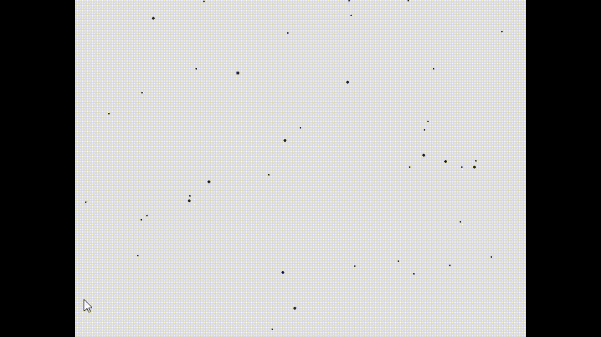

# The Coding Train Starfield implementation in Rust & Raylib
The implementation of https://www.youtube.com/watch?v=17WoOqgXsRM from original **JavaScript & p5.js** to **Rust & Raylib**
# Example

# Added features
```
- Added custom simulation color inversion depending on Y mouse position within the window frame 
```
# Run / Build
Run / Build with rust cargo
```
cargo run
cargo build
```
# Dependencies
*from crates.io*<br>
rand "0.8.5" - random number generation<br>
raylib "5.0.1" - safe raylib rust bindings 